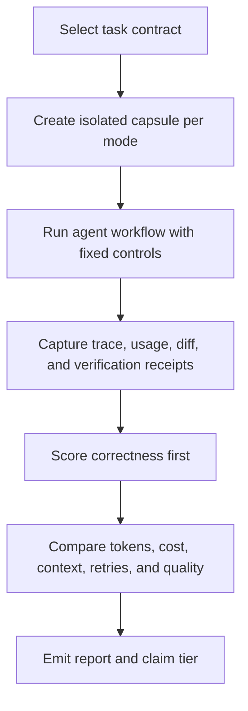

# SO-Wide Impact Evaluation Plane

## Purpose

Cognitive OS needs the same kind of controlled, falsifiable evaluation that a focused Graphify trial can provide, but applied to the whole operating system. The goal is not to prove that every primitive always helps. The goal is to measure when the OS improves delivery, when it only adds ceremony, and which primitive family produced the difference.

This evaluation plane turns broad claims such as "Cognitive OS reduces token use" or "Cognitive OS improves agent delivery" into paired, replayable experiments with the same task, same fixture project, same model/harness, same verification commands, and isolated state per run.

## Existing substrate

The repository already contains partial pieces of this plane:

- `scripts/so_vs_vanilla_benchmark.py` runs configured tasks in `vanilla` and `so` modes through the dispatch layer.
- `docs/08-References/benchmarks/so-vs-vanilla-tasks.yaml` defines benchmark task inputs.
- `scripts/cos-token-savings-audit` estimates structural token savings from context-shaping primitives.
- `scripts/cos-token-optimization-consumer-smoke` and `scripts/cos-portable-ai-real-consumer-smoke` exercise consumer-project portability and token-optimization surfaces.
- `scripts/agent-orchestration-benchmark.py` and `scripts/skill-router-benchmark.py` benchmark orchestration and skill-routing behavior.
- `scripts/cos-loop-eval`, `scripts/cos-loop-report`, `scripts/cos-process-loop`, and the process-loop report tools provide durable loop/process evidence.

These are enough to start controlled comparisons, but they are not yet a complete workflow-level A/B evaluation plane.

## Current gap

The current `so_vs_vanilla_benchmark.py` path is dispatch-level. It can compare routing and recorded metrics, but it does not yet prove the full IDE/CLI workflow effect of Cognitive OS because it does not consistently capture:

- isolated temporary worktrees or capsules per mode;
- real file-changing tool traces;
- provider-normalized usage receipts;
- generated diffs and touched-file counts;
- verification command receipts;
- process-loop state transitions;
- claim/false-completion events;
- ablation runs that isolate which primitive family caused the delta.

The SO-wide plane closes that gap by making benchmark runs artifact-producing workflows, not only routing measurements.

## Evaluation modes

Every task class should be runnable in at least these modes:

| Mode | Purpose |
| --- | --- |
| `vanilla` | Baseline harness with Cognitive OS governance disabled. |
| `full-so` | Full Cognitive OS behavior enabled. |
| `graphify-only` | Context graph/preload behavior enabled without unrelated governance. |
| `process-loop-only` | Loop/process contract behavior enabled without unrelated optimizers. |
| `skill-selection-only` | Stack/change skill selection enabled in isolation. |
| `token-optimization-only` | Context budget, prompt minimization, cache, and token reporting enabled in isolation. |
| `governance-hooks-only` | Safety/quality hooks enabled without higher-level process orchestration. |
| `full-so-minus-graphify` | Full SO except Graphify, to measure Graphify's marginal effect. |
| `full-so-minus-process-loop` | Full SO except process-loop gates, to measure process discipline's marginal effect. |

A mode that is not supported by a specific harness must be recorded as `unsupported`, not silently approximated.

## Controlled task contract

Each benchmark task should have an explicit contract. The contract is the source of truth for fair comparison.

```yaml
schema: cos.so-impact-eval.v1
taskId: pricing-format-refactor
class: refactor
fixture:
  repo: fixtures/pricing-service
  setupCommands:
    - make install
  resetPolicy: clean-worktree-per-mode
prompt:
  objective: Consolidate duplicated price formatting into one shared module.
  constraints:
    - Preserve public API behavior.
    - Do not change unrelated files.
controls:
  harness: codex
  provider: openai
  model: fixed-by-runner
  maxDiscoveryToolCalls: 14
  maxTotalToolCalls: 40
  maxWallClockSeconds: 1200
  allowedTools:
    - read
    - write
    - edit
    - grep
    - shell
verification:
  commands:
    - make test
    - make lint
metrics:
  requireUsageReceipt: true
  requireDiffReceipt: true
  requireVerificationReceipt: true
modes:
  - vanilla
  - full-so
  - full-so-minus-graphify
  - graphify-only
verdict:
  correctness: required
  compareTokens: after-correctness
  compareLatency: advisory
```

## Execution model



The runner must never reuse mutable state between modes unless the contract explicitly marks that state as shared and deterministic. Each mode gets its own checkout, trace directory, metrics directory, and verification receipt.

## Metrics

Correctness is the gate. Efficiency metrics are interpreted only after the output is correct.

| Metric | Required | Notes |
| --- | --- | --- |
| Final verification status | Yes | The configured commands must pass for any positive claim. |
| Total tokens | Yes, when provider exposes usage | Normalize input, output, cached, and reasoning tokens separately when possible. |
| Cost | Yes, when pricing is known | Record missing pricing as `unknown`, not zero. |
| Wall-clock time | Yes | Advisory because model reasoning and machine load can dominate. |
| Discovery context lines | Yes | Count lines read during discovery before implementation. |
| Discovery tool calls | Yes | Compare search/read fan-out. |
| Total tool calls | Yes | Detect excessive loops or hidden overhead. |
| Relevant files found | Yes | Human or oracle-reviewed list for coverage quality. |
| Diff size and files touched | Yes | Large diffs are not automatically bad, but must be visible. |
| Retries and repeated tool patterns | Yes | Feed loop-guard and no-progress detection. |
| False completion events | Yes | Any pass claim before verification is a quality regression. |
| Blocked unsafe actions | Yes | Positive safety signal, but should not mask failed delivery. |
| Final diff quality | Recommended | Reviewer rubric or task-specific oracle. |

## Artifact layout

A completed run writes a durable, reviewable bundle:

```text
docs/09-Quality/evals/so-impact/{task-id}/{run-id}/
  contract.yaml
  report.md
  vanilla/
    trace.jsonl
    usage.json
    diff.patch
    verify.json
    process.json
  full-so/
    trace.jsonl
    usage.json
    diff.patch
    verify.json
    process.json
  ablations/
    full-so-minus-graphify/
      trace.jsonl
      usage.json
      diff.patch
      verify.json
      process.json
```

The report should include a compact table similar to a paired Graphify trial, but generalized to the whole SO:

| Metric | Vanilla | Full SO | Delta | Verdict |
| --- | ---: | ---: | ---: | --- |
| Verification | pass | pass | same | comparable |
| Total tokens | 72,650 | 60,592 | -17% | SO better |
| Discovery context lines | 1,085 | 530 | -51% | SO better |
| Total tool calls | 24 | 21 | -3 | SO better |
| Relevant files found | 21 | 18 | -3 | inspect gap |
| False completion events | 1 | 0 | -1 | SO better |

Numbers above are illustrative only. Real reports must use measured receipts from the run bundle.

## Scoring and verdicts

The scorer applies this order:

1. **Correctness gate**: if verification fails, no positive efficiency claim is allowed.
2. **Safety gate**: if unsafe edits, secret exposure, or forbidden paths occur, the mode fails regardless of token savings.
3. **Coverage gate**: if the mode misses task-critical files that another correct mode found, mark the savings as suspect.
4. **Efficiency comparison**: compare tokens, cost, context lines, tool calls, and retries only after gates pass.
5. **Quality comparison**: compare final diff quality and review findings.

Verdicts should be conservative:

| Verdict | Meaning |
| --- | --- |
| `win` | Same or better correctness and quality, with meaningful efficiency or safety improvement. |
| `neutral` | No material difference, or benefits are offset by overhead. |
| `loss` | Worse correctness, quality, safety, or materially higher overhead. |
| `inconclusive` | Missing receipts, unsupported mode, noisy run, or insufficient oracle evidence. |

## Claim tiers

Broad product claims require evidence tiering.

| Tier | Evidence allowed |
| --- | --- |
| Structural estimate | Static or synthetic savings estimate only. Useful for sizing, not marketing claims. |
| Paired live run | One controlled workflow task with receipts. Supports task-local claims only. |
| Replicated task class | At least three tasks of the same class pass paired live runs. Supports class-level claims. |
| Cross-harness | Same task class reproduced in at least two supported CLI/IDE harnesses. Supports portability claims. |
| Cross-provider | Same task class reproduced across providers or usage-normalization adapters. Supports provider-neutral claims. |

A broad claim such as "Cognitive OS optimizes tokens portably for projects" is blocked until at least replicated task-class evidence exists and no correctness regression is observed.

## Relationship to Graphify

Graphify is one context-optimization primitive and one ablation mode inside this plane. It can improve context selection and reduce discovery fan-out, but the SO-wide evaluator must also measure process loops, skill selection, governance hooks, token budgeting, and verification behavior.

The right claim shape is therefore:

- valid: "In this paired run, the Graphify-enabled mode reduced discovery context while preserving verification."
- valid: "Across these task classes, full Cognitive OS reduced total tokens without reducing correctness."
- invalid: "Graphify proves the whole SO saves tokens everywhere."
- invalid: "A structural savings estimate proves live runtime savings."


## Implemented primitive

The first maintainer implementation is `scripts/cos-so-impact-eval`, backed by `scripts/cos_so_impact_eval.py` and ADR-338. It accepts a `cos.so-impact-eval.v1` contract, creates isolated capsules for each selected mode, runs declared workflow and verification commands, and writes `trace.jsonl`, `usage.json`, `diff.patch`, `verify.json`, `process.json`, `report.json`, and `report.md` receipts.

The bundled smoke contract is `docs/08-References/benchmarks/so-impact-money-format-refactor.yaml`; it uses the deterministic fixture at `fixtures/so-impact/money-format-refactor` so the full receipt path can be tested without provider cost.

```bash
scripts/cos-so-impact-eval plan \
  --contract docs/08-References/benchmarks/so-impact-money-format-refactor.yaml \
  --json

scripts/cos-so-impact-eval run \
  --contract docs/08-References/benchmarks/so-impact-money-format-refactor.yaml \
  --mode vanilla \
  --mode full-so \
  --json
```

## Implementation slices

Completed first slice:

1. `scripts/cos-so-impact-eval` emits contract-shaped workflow receipts and a machine-readable `report.json`.
2. The runner creates a clean temporary capsule per mode and captures `trace.jsonl`, `diff.patch`, `usage.json`, `verify.json`, and `process.json`.
3. The initial mode matrix includes Graphify, process-loop, skill-selection, context/token optimization, governance-hook, and minus-ablation switches as environment-controlled workflow modes.
4. Reports render under `docs/09-Quality/evals/so-impact/` by default.
5. Unit and red-team tests reject missing receipts and prove arbitrary-cwd wrapper portability.

Remaining slices:

1. Add provider/harness usage normalization so token and cost receipts use one schema when real providers emit usage.
2. Connect live CLI/IDE harness runners so workflow commands can invoke actual agent sessions, not only deterministic smoke workflows.
3. Add richer quality oracles for real diffs beyond the current receipt and trace contract.
4. Promote slow or expensive replicated task-class runs to CI/nightly while keeping local smoke runs targeted.

## Validation checklist

Before promoting any SO-wide benchmark result:

- [ ] The task contract is committed or archived with the run bundle.
- [ ] Every compared mode ran from a clean isolated capsule.
- [ ] The same objective, controls, model policy, tool budget, and verification commands were used.
- [ ] Verification receipts exist for every mode.
- [ ] Usage receipts exist or the report explicitly marks usage as unavailable.
- [ ] Diff receipts exist for every file-changing mode.
- [ ] A human or oracle-reviewed relevant-file list exists for coverage comparison.
- [ ] Positive claims are scoped to the achieved claim tier.
- [ ] Unsupported harness/provider capabilities are reported as unsupported, not ignored.
