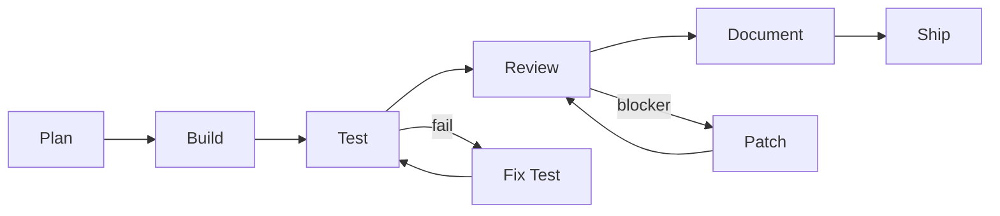

# TAC (Tactical Agentic Coding) Course Reference

Technical analysis of IndyDevDan's TAC course material at `reference/agentic/`. These patterns inform COS's pipeline-runner, workflow system, and agent primitives.

## Course Progression

| Module | Concept | Key Pattern |
|--------|---------|-------------|
| TAC-1 | CLI as building block | `claude -p <prompt>` from Python/Shell/TS |
| TAC-2 | Slash commands + specs | `.claude/commands/`, `specs/`, `ai_docs/` |
| TAC-3 | Plan-then-implement | `/feature` → `specs/*.md` → `/implement <spec>` |
| TAC-4 | Full ADW + GitHub + hooks | Python pipeline, webhook/cron triggers, session logging |
| TAC-5 | Composable pipelines | Shared state JSON (`adw_state.json`), modular phases |
| TAC-6 | Complete SDLC | + Review (structured JSON), + Document, + Patch retry loop |
| TAC-7 | Isolation + ZTE | Git worktrees (`trees/{adw_id}/`), Zero Touch Execution |
| TAC-8 | Agent primitives | 3 primitives (raw prompt, SDK, slash command), multi-source tasks |

## The Three Agent Primitives (TAC-8)

1. **Raw Prompt** (`adw_prompt.py`): Direct `claude -p "{text}"`. Maximum control, no abstraction.
2. **SDK Prompt** (`adw_sdk_prompt.py`): Uses `claude_code_sdk`. Supports `--resume {session_id}` for multi-turn conversations.
3. **Slash Command** (`adw_slash_command.py`): `execute_template(slash_command="/cmd", args=[...])`. Standard interface between orchestration and AI.

## ADW State Model

Every pipeline run gets an 8-char UUID (`adw_id`) and a persistent state file:

```json
{
  "adw_id": "b8f48e49",
  "issue_number": 2,
  "issue_class": "/feature",
  "branch_name": "feature-2-b8f48e49-jsonl-support",
  "plan_file": "specs/issue-2-adw-b8f48e49-sdlc_planner-jsonl-support.md",
  "worktree_path": "trees/b8f48e49/",
  "backend_port": 9103,
  "frontend_port": 9203,
  "model_set": "base",
  "all_adws": ["adw_plan_iso", "adw_build_iso", "adw_test_iso", "adw_review_iso"]
}
```

The `all_adws` list serves dual purpose: lineage tracking and KPI calculation (count of re-plans = attempts).

## The _iso Pattern (Worktree Isolation)

Every `_iso` script runs inside a dedicated git worktree at `trees/{adw_id}/`:
1. `adw_plan_iso.py` creates worktree: `git worktree add -b {branch} trees/{adw_id}/ origin/main`
2. Worktree gets `.ports.env` with deterministic ports (hash of adw_id mod 15)
3. All subsequent phases pass `cwd=worktree_path` to all operations
4. Up to 15 concurrent workflows without filesystem conflicts
5. Cleanup: `./scripts/purge_tree.sh {adw_id}`

## ZTE (Zero Touch Execution)

ZTE = full SDLC + auto-ship if all phases pass. Key differences from manual SDLC:
- Test failures **abort** (never ships broken code)
- Review failures **abort**
- Ship phase validates ALL state fields before merge
- `git merge --no-ff {branch}` to main, then push

The state field completeness check is the gate: if any phase failed to write its output, ship refuses.

## SDLC Phase Flow



Each phase: reads state → invokes slash command via `claude -p` → writes state → appends to `all_adws`.

## Hook Evolution

| Event | TAC-4 | TAC-5 | TAC-6 | TAC-7 | TAC-8 |
|-------|-------|-------|-------|-------|-------|
| PreToolUse | Block .env + rm -rf, log | Same | Same | Same | Same |
| PostToolUse | Log | Same | Same | Same | Same |
| Stop | Transcript capture | Same | Same | Same | Same |
| SubagentStop | Log | Same | Same | Same | Same |
| Notification | OS notify | Same | Same | Same | Same |
| PreCompact | — | — | Log context compression | Same | Same |
| UserPromptSubmit | — | — | Log + validate framework | Same | Same |
| SessionStart | — | — | — | — | Context injection |

## Key Patterns for COS Adoption

### 1. ADW State as Inter-Phase Contract
COS pipeline-runner should use a similar JSON state file with accumulated fields per phase.

### 2. Slash Commands as AI-Orchestration Seam
All AI work routed through named slash commands — makes the AI layer swappable.

### 3. Worktree Isolation for Parallel Agents
Any time COS runs >1 agent on shared codebase, use worktrees.

### 4. Structured Output Contracts
Every agent that returns structured data needs a Pydantic model. Parse stdout into types.

### 5. Model Set as Workflow Parameter
`model_set = base | heavy` specified at trigger time, stored in state, used by each command via lookup table.

### 6. Session Resumption
Capture `cc_session_id` from JSONL init line, store persistently, pass `--resume` for multi-turn.

### 7. KPI from State
`all_adws` list → count re-plans = attempts → streak metric for quality.

### 8. Deep Specs Before ADW Specs
Complex features get a human-written deep spec before any ADW runs.

### 9. Task Source as Plugin
GitHub issues → tasks.md → Notion: abstract behind `get_tasks()`, `claim_task()`, `update_task()`.

### 10. `uv run --script` for Hooks
Inline Python dependencies, zero install steps. Perfect for portable hook scripts.

## Source Reference

These patterns are from the [Tactical Agentic Coding](https://agenticengineer.com/tactical-agentic-coding) course by IndyDevDan. The course material is not included in the repo (gitignored). Key module/file mapping for reference:

| Module | Key Pattern | COS Equivalent |
|--------|------------|----------------|
| TAC-4: `adws/agent.py` | Claude CLI subprocess wrapper with JSONL parsing | `lib/claude_executor.py` |
| TAC-4: `adws/data_types.py` | Pydantic types for ADW requests/responses | `lib/pipeline_executor.py` (inline) |
| TAC-5: `adws/adw_modules/state.py` | JSON state persistence with phase tracking | `lib/sdd_resume.py` |
| TAC-6: `adws/adw_review.py` | Review phase with blocker retry loop (max 3) | `sdd-verify` skill |
| TAC-6: `adws/adw_sdlc.py` | Complete SDLC pipeline orchestrator | `lib/pipeline_executor.py` |
| TAC-7: `adws/adw_modules/worktree_ops.py` | Git worktree isolation + port allocation | Not yet implemented (deferred) |
| TAC-7: `adws/adw_sdlc_zte_iso.py` | ZTE (Zero Touch Execution) pipeline | `.cognitive-os/workflows/` + pipeline_executor |
| TAC-8: Agent layer primitives | 3 primitives: raw prompt, SDK, slash command | `ClaudeExecutor.run()`, `.slash()` |
| TAC-3: `.claude/commands/feature.md` | Canonical plan template format | SDD skills (sdd-propose, etc.) |
