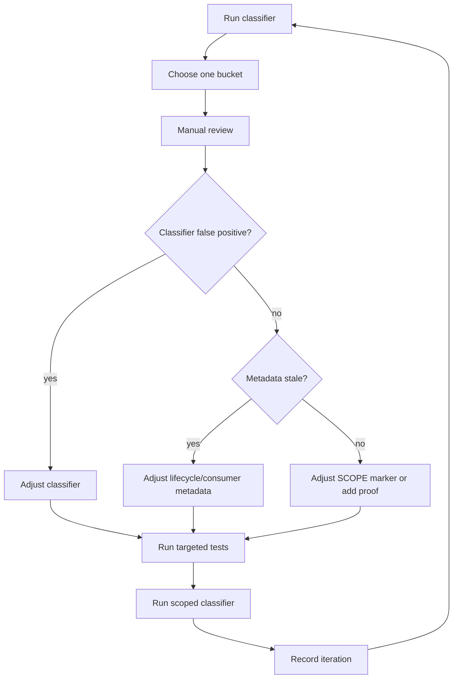

# Primitive Scope Classifier Iteration Control — 2026-05-14

## Purpose

Control the scope-taxonomy calibration loop so classification changes are not made by intuition, grep-only rules, or one-shot bulk edits.

This control record governs iterative work on `SCOPE` classification for agentic primitives.

## Non-negotiable rules

1. Do not mass-edit `SCOPE` markers from a full-repo classifier run.
2. Treat classifier output as a hypothesis, not truth.
3. Every iteration must include:
   - target bucket;
   - hypothesis;
   - exact row count;
   - sample or complete row list;
   - manual finding;
   - classifier adjustment or metadata/marker action;
   - validation command;
   - post-iteration summary.
4. `unknown` is not `os-only` taxonomy truth. It only has `effective_scope=os-only` as safe projection fallback.
5. `both` requires positive distribution evidence and paired portability/falsification proof before being considered confirmed.
6. `project` needs its own evidence model; do not collapse it into `both` or `os-only` without consumer-project-only proof.

## Iteration state machine



## Baseline: Iteration 0

Command:

```bash
.venv/bin/python scripts/primitive_scope_classifier.py --project-dir .
```

Latest baseline after classifier hardening and `unknown` split:

```json
{
  "total": 1198,
  "by_suggested_scope": {
    "both": 65,
    "os-only": 453,
    "unknown": 680
  },
  "by_effective_scope": {
    "both": 65,
    "os-only": 1133
  },
  "contradictions": 262,
  "low_confidence": 680
}
```

Validation baseline:

```bash
.venv/bin/python -m pytest \
  tests/unit/test_primitive_scope_classifier.py \
  tests/red_team/portability/test_cos_init.py \
  tests/contracts/test_primitive_scope_classification.py \
  tests/unit/test_primitive_scope_governance.py \
  tests/unit/test_scope_both_portability_audit.py -q
```

Observed: `21 passed`.

## Iteration backlog

| Order | Bucket | Current count | Why this order | Allowed actions |
|---:|---|---:|---|---|
| 1 | `suggested_scope=both` | 65 | Smallest positive set; easiest to detect false positives before trusting the classifier. | Adjust classifier, add proof, fix stale metadata, or mark candidates. |
| 2 | `suggested_scope=os-only` | 453 | Positive `os-only` evidence may still contain stale lifecycle/consumer metadata. | Review by evidence source, not by marker. |
| 3 | `suggested_scope=unknown` | 680 | Missing metadata bucket; should produce metadata/proof tasks, not marker flips. | Add lifecycle/consumer/projection metadata or leave unknown. |
| 4 | `contradictions` | 262 | Mixed set; should be handled after classifier semantics stabilize. | Resolve by small evidence-family batches. |
| 5 | `project` model | TBD | Project-only needs a stronger positive evidence model. | Add project-only evidence sources before changing markers. |

## Iteration template

Copy this for every pass:

```md
### Iteration N — [bucket]

- Date:
- Operator:
- Target bucket:
- Input command:
- Input count:
- Hypothesis:
- Manual review method:
- Findings:
  - Confirmed correct:
  - False positives:
  - False negatives:
  - Metadata stale:
- Changes made:
- Validation:
- Output count:
- Decision:
- Next bucket:
```

## Iteration 1 plan

Target: `suggested_scope=both` hardened set.

Hypothesis: the 65 positive `both` rows split into:

- confirmed `both` rows with marker + distribution evidence + paired proof;
- candidate `both` rows with metadata evidence but missing marker/proof alignment;
- possible false positives caused by stale lifecycle or protected-install metadata.

Acceptance criteria for Iteration 1:

1. No classifier semantics change without a regression test.
2. No marker changes unless the row has explicit distribution evidence and proof or a documented proof task.
3. Produce a row-level review table for all 65 rows or a generated artifact equivalent.
4. Keep targeted validation green.

## Stop conditions

Stop and escalate instead of continuing if:

- a bucket requires product/architecture intent not encoded in metadata;
- lifecycle and consumer-availability conflict and neither is obviously stale;
- more than 10 rows need the same new evidence source not currently modeled;
- a classifier adjustment increases false positives in a previously reviewed bucket.

### Iteration 1 — suggested_scope=both

- Date: 2026-05-14
- Operator: Codex
- Target bucket: `suggested_scope=both`
- Input command: `.venv/bin/python scripts/primitive_scope_classifier.py --project-dir .`
- Input count: 65
- Hypothesis: positive `both` rows include confirmed portable rows plus candidates with proof/header gaps.
- Manual review method: row-level categorization by marker, paired proof, contradiction, and positive evidence source.
- Findings:
  - Confirmed correct: 48
  - False positives requiring classifier fixes: already addressed before this iteration; none newly changed in this pass.
  - Metadata/proof/header candidates: 17
  - Metadata stale: unresolved, candidate rows require per-row follow-up.
- Changes made: generated row-level review artifact only; no marker changes.
- Validation: targeted classifier and pytest lane remained green.
- Output artifact: `docs/06-Daily/reports/primitive-scope-classifier-iteration-001-both-review-2026-05-14.md`
- Decision: keep 48 confirmed `both`; treat 17 as work items, not automatic flips.
- Next bucket: `suggested_scope=os-only`, grouped by consumer availability and lifecycle evidence.


## Package-skill inventory update

Re-reviewing commit `33682e2e` showed the classifier initially missed `packages/*/skills/*/SKILL.md`. The inventory now includes packaged skills. This increased total rows and unknown/contradiction counts but did not change the Iteration 1 `both` confirmed set.

### Iteration 2 — consumer-availability `os-only`

- Date: 2026-05-14
- Operator: Codex
- Target bucket: `suggested_scope=os-only` rows with `consumer-availability → os-only` evidence
- Input command: `.venv/bin/python scripts/primitive_scope_classifier.py --project-dir .`
- Input count before adjustment: 90
- Hypothesis: explicit consumer availability maintainer/local-only is strong `os-only` evidence, but lifecycle conflicts must not be ignored.
- Manual review method: inspect rows with consumer-availability `os-only`, compare against lifecycle distribution and declared marker.
- Findings:
  - Confirmed/remaining consumer-availability `os-only` rows after adjustment: 51
  - False positives / overconfident rows moved to `unknown`: 39
  - Metadata stale/conflicting: 39 rows with consumer availability `os-only` but lifecycle `team/core`
- Changes made: classifier now reports close competing distribution evidence as `suggested_scope=unknown`, `decision_source=conflicting-distribution-evidence`.
- Validation: classifier unit tests updated and targeted lanes passed.
- Output artifact: `docs/06-Daily/reports/primitive-scope-classifier-iteration-002-consumer-os-only-review-2026-05-14.md`
- Decision: do not change markers from conflict rows; reconcile metadata first.
- Next bucket: remaining `suggested_scope=os-only` rows by lifecycle-only evidence.

### Iteration 3 — lifecycle-only `os-only`

- Date: 2026-05-14
- Operator: Codex
- Target bucket: `suggested_scope=os-only` rows with lifecycle `os-only` evidence and no consumer-availability evidence
- Input command: `.venv/bin/python scripts/primitive_scope_classifier.py --project-dir .`
- Input count: 211
- Hypothesis: lifecycle-only `lab`/`maintainer` metadata is useful evidence, but not enough for automatic marker changes because lifecycle can be stale.
- Manual review method: bucket rows by lifecycle detail and declared marker; do not edit markers.
- Findings:
  - Marker already aligned with lifecycle `os-only`: 71
  - Missing-header lifecycle `os-only`: 11
  - Candidate lab marker alignment: 68
  - Candidate maintainer marker alignment: 60
  - Candidate inactive marker alignment: 1
- Changes made: generated row-level review artifact only; no classifier or marker changes.
- Validation: targeted lanes passed.
- Output artifact: `docs/06-Daily/reports/primitive-scope-classifier-iteration-003-lifecycle-os-only-review-2026-05-14.md`
- Decision: lifecycle-only contradictions remain candidates pending lifecycle freshness review.
- Next bucket: `suggested_scope=unknown`, starting with conflicting-distribution-evidence rows.

### Iteration 4 — project scope model

- Date: 2026-05-14
- Operator: Codex
- Target bucket: primitives declared `SCOPE: project`
- Input command: `.venv/bin/python scripts/primitive_scope_classifier.py --project-dir .`
- Input count: 64 declared project rows
- Hypothesis: project-only needs a first-class model; absence of metadata should not collapse declared project rows into `unknown`/`os-only`.
- Manual review method: inspect all declared project rows and classify whether stronger both/os-only/conflicting evidence exists.
- Findings:
  - Project rows preserved as low-confidence project pending proof: 35
  - Project marker conflicts with os-only evidence: 16
  - Project marker conflicts with both evidence: 6
  - Project marker unknown/insufficient/conflicting metadata: 7
- Changes made: classifier now emits `suggested_scope=project`, `decision_source=declared-project-pending-proof`, `confidence=low` when an explicit project marker has no stronger metadata.
- Validation: classifier unit tests updated and targeted lanes passed.
- Output artifact: `docs/06-Daily/reports/primitive-scope-classifier-iteration-004-project-scope-review-2026-05-14.md`
- Decision: `project` remains a first-class bucket; low-confidence project rows require positive project-only evidence before being treated as confirmed.
- Next bucket: unknown rows by missing metadata vs conflicting metadata.


### Iteration 5 — project-vs-both evidence semantics

- Date: 2026-05-14
- Operator: Codex
- Target bucket: declared `SCOPE: project` rows suggested as `both`
- Input command: `.venv/bin/python scripts/primitive_scope_classifier.py --project-dir .`
- Input count: 6 original project-vs-both rows from Iteration 4
- Hypothesis: project-facing candidate evidence was being over-read as `both` evidence.
- Manual review method: inspect headers, lifecycle rows, consumer-availability rows, protected install surface metadata, and primitive bodies for the six rows.
- Findings:
  - Classifier false positives fixed: 3 (`scripts/check_mcp_servers.py`, `scripts/docs_execution_audit.py`, `scripts/project_scaffold.py`)
  - Still unresolved `both` contradictions: 3 (`hooks/destructive-rm-blocker.sh`, `scripts/dependency-lane.sh`, `scripts/setup.sh`)
  - Confirmed project-visible bucket after adjustment: 50 suggested project rows
- Changes made: consumer-availability projectable statuses and lifecycle `consumer_accessibility: lifecycle-declared-consumer-candidate` now produce `project` evidence instead of `both` evidence.
- Validation: `.venv/bin/python -m pytest tests/unit/test_primitive_scope_classifier.py -q` observed `11 passed`.
- Output artifact: `docs/06-Daily/reports/primitive-scope-classifier-iteration-005-project-vs-both-review-2026-05-14.md`
- Decision: project-facing evidence is not `both` proof; continue resolving remaining contradictions by evidence family, without marker mass edits.
- Next bucket: declared `project` rows with lifecycle `os-only` evidence, or the remaining three project-vs-both contradictions after ADR/body review.


### Iteration 6 — unknown triage queue

- Date: 2026-05-14
- Operator: Codex
- Target bucket: `suggested_scope=unknown`
- Input command: `.venv/bin/python scripts/primitive_scope_unknown_triage.py --project-dir .`
- Input count: 684 unknown rows
- Hypothesis: one-by-one review is too expensive; the unknown bucket should first be grouped by missing evidence, metadata conflicts, and semantic hints.
- Manual review method: deterministic content scan for SO-internal hints, generic repository-construction hints, project-only hints, and classifier evidence gaps.
- Findings:
  - Missing lifecycle and consumer-availability evidence dominates: 645 rows have no distribution evidence.
  - Declared `both` without paired proof dominates: 481 rows.
  - Triage buckets: 364 declared-both-needs-proof-and-metadata; 92 declared-both-os-internal-heavy; 120 insufficient-metadata; 39 conflicting-metadata; 33 missing-scope-marker; 27 os-only-semantic-candidate; 6 both-semantic-candidate; 3 project-only-semantic-candidate.
- Changes made: added `scripts/primitive_scope_unknown_triage.py`, unit tests, JSON report, Markdown report, and docs links.
- Validation: targeted tests passed.
- Output artifact: `docs/06-Daily/reports/primitive-scope-unknown-triage-latest.md`
- Decision: unknown review should proceed bucket-first; AI can be used as an adjudicator over these rows, but only with evidence citations and abstention.
- Next bucket: review `declared-both-os-internal-heavy` first because it likely contains stale `both` markers.


### Iteration 7 — declared `both` with OS-internal-heavy content

- Date: 2026-05-14
- Operator: Codex
- Target bucket: `declared-both-os-internal-heavy`
- Input command: `.venv/bin/python scripts/primitive_scope_unknown_triage.py --project-dir .`
- Input count: 92 rows
- Hypothesis: this bucket likely contains stale `both` markers, but some rows may be portable principles or wrappers implemented with COS internals.
- Manual review method: inspect path, summary, semantic hints, and selected bodies for generic-vs-COS-specific value proposition.
- Findings:
  - Likely `os-only` marker stale: 80
  - Possible `both` portable behavior needing proof: 5
  - Possible `both` portable principle: 2
  - Possible `both` portable wrapper needing proof: 2
  - Split-or-os-only: 2
  - Possible `project` only: 1
- Changes made: generated row-level review artifact only; no marker changes.
- Validation: documentation/report-only iteration; no marker or classifier logic changed.
- Output artifact: `docs/06-Daily/reports/primitive-scope-classifier-iteration-007-declared-both-os-internal-review-2026-05-14.md`
- Decision: do not mass-edit; next implementation pass should update metadata/markers only for a small family, starting with likely OS-only hook/script internals or with split candidates.
- Next bucket: choose one family from the 80 likely-os-only rows, or proof the 9 possible-both rows before keeping their `both` markers.


### Iteration 8 — `add-hook` / `add-skill` split-or-os-only correction

- Date: 2026-05-14
- Operator: Codex
- Target bucket: two `split-or-os-only` rows from Iteration 7
- Input paths: `skills/add-hook/SKILL.md`, `skills/add-skill/SKILL.md`
- Hypothesis: current bodies are COS-specific, even though generic authoring concepts could become separate portable primitives.
- Manual review method: inspect skill bodies, catalogs, existing red-team load checks, and metadata gaps.
- Findings:
  - Both current skills modify Cognitive OS source/catalog/routing/projection/gate surfaces.
  - Existing audience was already `os`; only the `SCOPE` marker was over-broad.
  - Old structural load tests do not prove semantic portability.
- Changes made: changed both markers to `os-only`, added scope notes, added maintainer-only consumer/lifecycle metadata, updated skill registry hashes, and reworded old load-check docstrings.
- Validation: scoped classifier reports 2 high-confidence `os-only` rows with 0 contradictions.
- Output artifact: `docs/06-Daily/reports/primitive-scope-classifier-iteration-008-add-hook-add-skill-correction-2026-05-14.md`
- Decision: current artifacts are `os-only`; create separate `both` primitives only if generic authoring guidance is extracted.
- Next bucket: either proof the 9 possible-`both` rows from Iteration 7 or continue likely-os-only family correction in small batches.


### Iteration 9 — possible `both` proof review

- Date: 2026-05-14
- Operator: Codex
- Target bucket: nine possible-`both` rows from Iteration 7
- Input paths: `rules/recommendation-grounding.md`, `rules/trust-score.md`, `hooks/agent-output-verifier.sh`, `hooks/clarification-interceptor.sh`, `hooks/epic-task-detector.sh`, `hooks/resource-check.sh`, `hooks/subagent-capability-preflight.sh`, `scripts/cos-governed-agent.sh`, `scripts/cos-governed-edit.sh`
- Hypothesis: these rows encode portable repository/agent governance behavior despite COS-specific implementation details.
- Manual review method: inspect bodies, paired portability tests, and whether core value is COS self-construction or repo-agnostic behavior.
- Findings:
  - Confirmed `both`: 9
  - Downgraded: 0
  - Split required now: 0
  - Proof quality caveat: several proofs are safe-invocation/structural probes and should be made more behavioral later.
- Changes made: added lifecycle metadata for all nine with `distribution: team`, `owner_adr: ADR-314`, paired proof commands, and portable-behavior evidence.
- Validation: scoped classifier reports 9 medium-confidence `both` rows with 0 contradictions; paired proof tests observed `9 passed`.
- Output artifact: `docs/06-Daily/reports/primitive-scope-classifier-iteration-009-possible-both-proof-review-2026-05-14.md`
- Decision: keep all nine as `both`; future work should strengthen proof depth rather than demote by default.
- Next bucket: continue `declared-both-os-internal-heavy`, now 81 rows, starting with likely OS-only hook/script internals.
